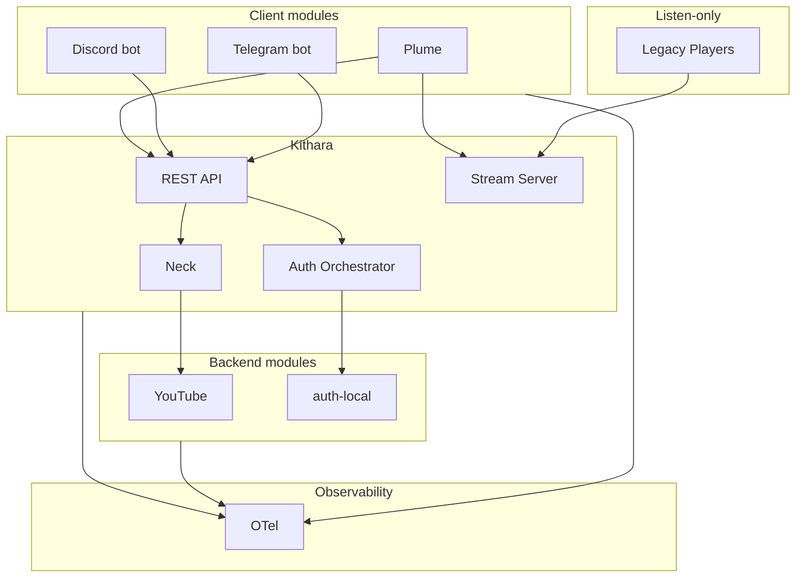

# Component Landscape

## Components

| Component | Type | MVP |
|-----------|------|-----|
| Kithara | Core monolith | Yes |
| Plume | Client module (web) | Yes |
| Discord bot | Client module | Future |
| Telegram bot | Client module | Future |
| YouTube module | Source adapter | Yes |
| auth-local | Auth adapter | Yes |
| auth-oidc | Auth adapter | v0.2 |
| Legacy players | Listen-only | Yes |
| Icecast | Output relay | Community demand only |

**Client modules** are the modular user-facing layer — web, Discord, Telegram, and more. They share Kithara's REST API; only Plume is required for MVP.

No Icecast in MVP — Kithara serves ICY directly.

**Kithara detail:** [Container diagram](https://github.com/Bardie-radio/bardie-kithara/blob/main/docs/architecture/overview/02-container-diagram.md) · [Client modules](https://github.com/Bardie-radio/bardie-kithara/blob/main/docs/architecture/domains/clients.md)

**Read next:** [04-user-journeys.md](04-user-journeys.md)
