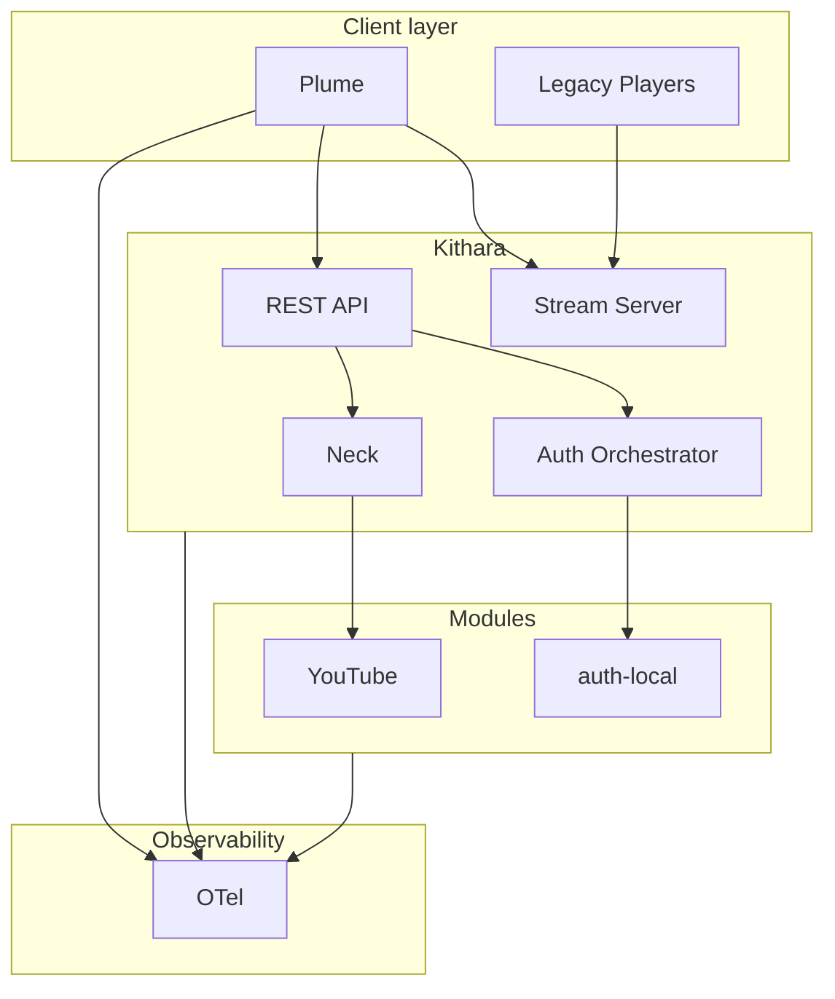

# Component Landscape

## Components

| Component | Type | MVP |
|-----------|------|-----|
| Kithara | Core monolith | Yes |
| Plume | Web UI | Yes |
| YouTube module | Source adapter | Yes |
| auth-local | Auth adapter | Yes |
| auth-oidc | Auth adapter | v0.2 |
| Discord bot | Client | Future |
| Icecast | Output relay | Community demand only |

No Icecast in MVP — Kithara serves ICY directly.

**Kithara detail:** [Container diagram](https://github.com/Bardie-radio/bardie-kithara/blob/main/docs/architecture/overview/02-container-diagram.md)

**Read next:** [04-user-journeys.md](04-user-journeys.md)
