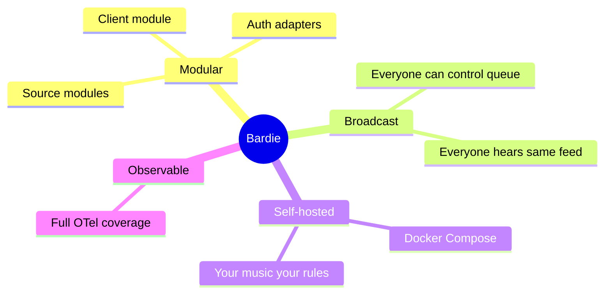

# Vision and Goals

<!-- mermaid-source: diagrams/vision-and-goals.mmd -->

## Vision

Bardie lets friends listen to music together **without** proprietary streaming services, manual sync rituals, or Discord screen-share compression.

## Goals

1. **Modular** — swap audio sources and auth providers via containers
2. **Broadcast** — radio-style shared experience per Struna
3. **Self-hosted** — full control on your infrastructure
4. **Player-friendly** — ICY HTTP URLs for VLC, VRChat, browsers
5. **Observable** — every module emits telemetry; end-to-end traces

## Non-goals (MVP)

- Spotify-style per-user seek position
- Bundled Icecast
- Public anonymous DJ (no public control plane)

**Deep dive:** [bardie-kithara architecture docs](https://github.com/Bardie-radio/bardie-kithara/tree/main/docs/architecture)

**Read next:** [02-ecosystem-context.md](02-ecosystem-context.md)
