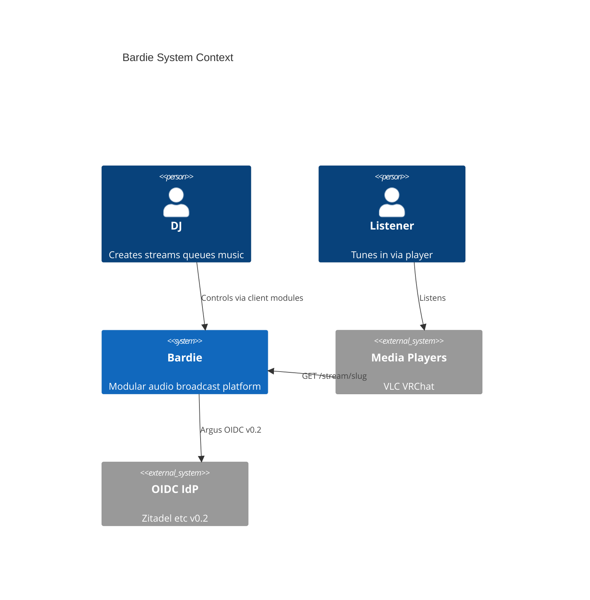

# Ecosystem Context

<!-- mermaid-source: profile/docs/architecture/diagrams/ecosystem-context.mmd -->

> Diagram uses C4-PlantUML-style notation in Mermaid for orientation. Source: [diagrams/ecosystem-context.mmd](diagrams/ecosystem-context.mmd)

Bardie sits between **DJs** (stream owners), **listeners** (tune in anywhere), and **pluggable modules** — client surfaces, audio sources, and auth.

## Repositories

| Component | Repository |
|-----------|------------|
| Core | [kithara](https://github.com/Bardie-radio/kithara) |
| Web UI (Plume) | [plume](https://github.com/Bardie-radio/plume) |
| Login+password (Bes, MVP) | [bes](https://github.com/Bardie-radio/bes) *(WIP)* |
| YouTube / ytdl (Magpie, MVP) | [magpie](https://github.com/Bardie-radio/magpie) *(WIP)* |
| Discord (Beak) | [beak](https://github.com/Bardie-radio/beak) *(planned)* |
| Telegram (Cauda) | [cauda](https://github.com/Bardie-radio/cauda) *(planned)* |
| External stream (Starling) | [starling](https://github.com/Bardie-radio/starling) *(planned)* |
| Files (Catbird) | [catbird](https://github.com/Bardie-radio/catbird) *(planned)* |
| OIDC (Argus, v0.2) | [argus](https://github.com/Bardie-radio/argus) *(planned)* |
| Passkeys (Hecate) | [hecate](https://github.com/Bardie-radio/hecate) *(planned)* |

**Related:** [org hub](README.md) · [kithara architecture](https://github.com/Bardie-radio/kithara/tree/main/docs/architecture)

**Read next:** [03-component-landscape.md](03-component-landscape.md)
