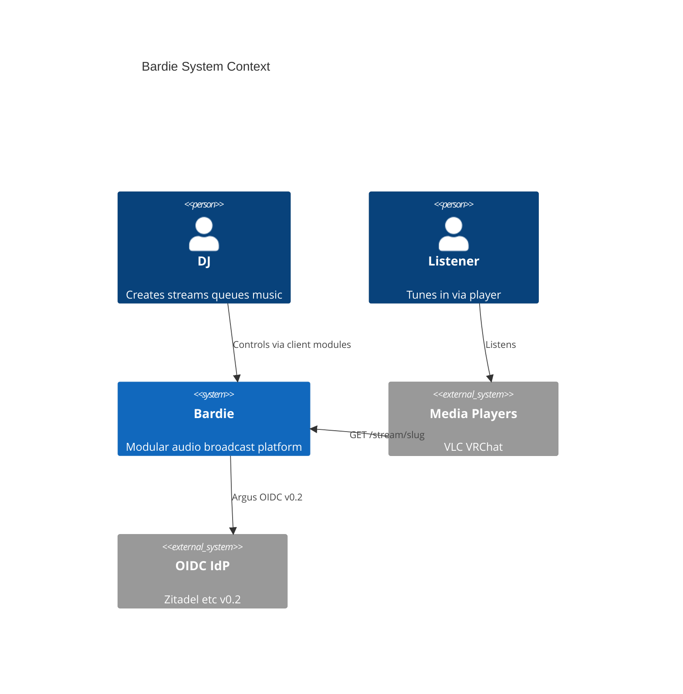

# Ecosystem Context

<!-- mermaid-source: profile/docs/architecture/diagrams/ecosystem-context.mmd -->

> Diagram uses C4-PlantUML-style notation in Mermaid for orientation. Source: [diagrams/ecosystem-context.mmd](diagrams/ecosystem-context.mmd)

Bardie sits between **DJs** (stream owners), **listeners** (tune in anywhere), and **pluggable modules** — client surfaces, audio sources, and auth.

## Repositories

| Component | Repository |
|-----------|------------|
| Core | [bardie-kithara](https://github.com/Bardie-radio/bardie-kithara) |
| Web UI (Plume) | [bardie-plume](https://github.com/Bardie-radio/bardie-plume) |
| Login+password (Bes, MVP) | [bardie-bes](https://github.com/Bardie-radio/bardie-bes) *(WIP)* |
| YouTube / ytdl (Magpie, MVP) | [bardie-magpie](https://github.com/Bardie-radio/bardie-magpie) *(WIP)* |
| Discord (Beak) | [bardie-beak](https://github.com/Bardie-radio/bardie-beak) *(planned)* |
| Telegram (Cauda) | [bardie-cauda](https://github.com/Bardie-radio/bardie-cauda) *(planned)* |
| External stream (Starling) | [bardie-starling](https://github.com/Bardie-radio/bardie-starling) *(planned)* |
| Files (Catbird) | [bardie-catbird](https://github.com/Bardie-radio/bardie-catbird) *(planned)* |
| OIDC (Argus, v0.2) | [bardie-argus](https://github.com/Bardie-radio/bardie-argus) *(planned)* |
| Passkeys (Hecate) | [bardie-hecate](https://github.com/Bardie-radio/bardie-hecate) *(planned)* |

**Related:** [org hub](README.md) · [kithara architecture](https://github.com/Bardie-radio/bardie-kithara/tree/main/docs/architecture)

**Read next:** [03-component-landscape.md](03-component-landscape.md)
