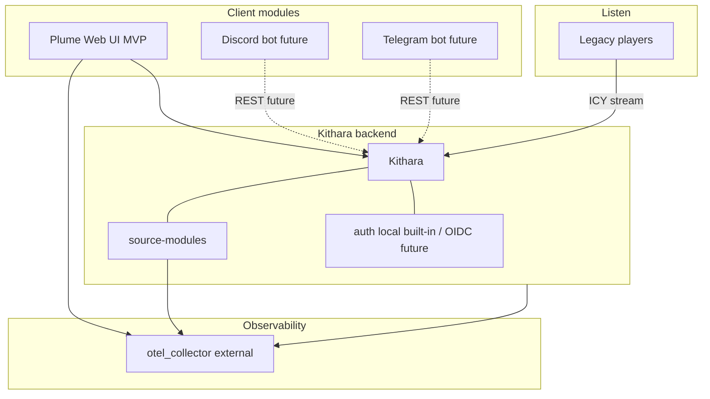

# Component Landscape

<!-- mermaid-source: profile/docs/architecture/diagrams/component-landscape.mmd -->

**Kithara** plus its source modules (and later OIDC adapters) are one backend system. Client modules and players sit outside. Internals (Neck, Stream Server, Auth Orchestrator) stay in the kithara deep dive.

## Components

| Type | Components | MVP |
|------|------------|-----|
| Core monolith | Kithara (incl. local password provider) | Yes |
| Client module | Plume (web), Discord bot, Telegram bot | Plume optional but primary UI; bots future |
| Source module | YouTube, Local input, File source | Yes (YouTube); Future (others) |
| Auth | Local built-in; OIDC adapter (v0.2) | Yes (local); names TBD for OIDC |
| Listener | Legacy players (ICY) | N/A |

**Client modules** share Kithara's REST API. Discord/Telegram are control clients later — not ICY paste targets like VLC.

No Icecast in MVP — Kithara serves ICY directly. OTel collector is **external**.

**Kithara detail:** [Internal structure](https://github.com/Bardie-radio/bardie-kithara/blob/main/docs/architecture/overview/02-internal-structure.md) · [Client modules](https://github.com/Bardie-radio/bardie-kithara/blob/main/docs/architecture/domains/clients.md)

**Related:** [uri-routing](https://github.com/Bardie-radio/bardie-kithara/blob/main/docs/architecture/interfaces/uri-routing.md) · [02-ecosystem-context](02-ecosystem-context.md)

**Read next:** [04-user-journeys.md](04-user-journeys.md)
