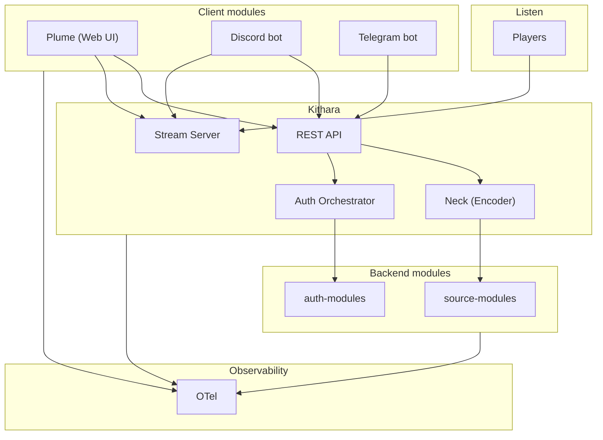

# Component Landscape

<!-- mermaid-source: diagrams/component-landscape.mmd -->

## Components

| Type | Components | MVP |
|------|------------|-----|
| Core monolith | Kithara | Yes |
| Client module | Plume (web), Discord bot, Telegram bot | Yes (Plume); v0.2 (Discord); Future (Telegram)|
| Source module | YouTube, Local input, File source | Yes (YouTube); Future (Direct input, File) |
| Auth adapter | auth-local, auth-oidc | Yes (auth-local); v0.2 (auth-oidc) |
| Listener | Legacy players | N/A |

**Client modules** are the modular user-facing layer — web, Discord, Telegram, and more. They share Kithara's REST API; only Plume is required for MVP.

No Icecast in MVP — Kithara serves ICY directly.

**Kithara detail:** [Container diagram](https://github.com/Bardie-radio/bardie-kithara/blob/main/docs/architecture/overview/02-container-diagram.md) · [Client modules](https://github.com/Bardie-radio/bardie-kithara/blob/main/docs/architecture/domains/clients.md)

**Read next:** [04-user-journeys.md](04-user-journeys.md)
