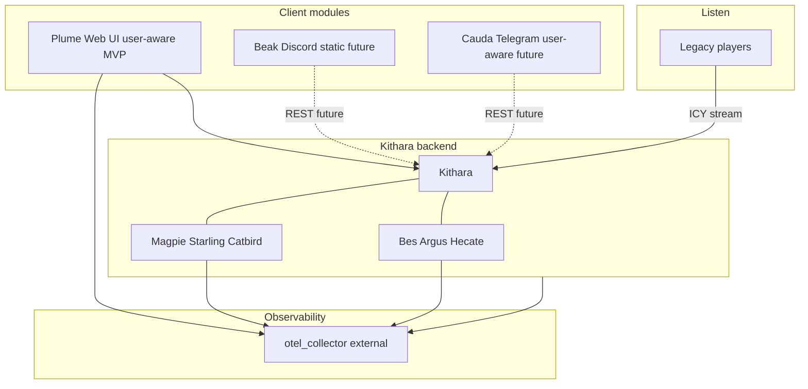

# Component Landscape

<!-- mermaid-source: profile/docs/architecture/diagrams/component-landscape.mmd -->

**Kithara** plus its source and auth modules form the backend. Client modules and players sit outside. Internals (Neck, Stream Server, Auth Orchestrator) stay in the kithara deep dive. There is **no built-in auth** — Bes/Argus/Hecate are separate containers.

## Components

| Type | Components | MVP |
|------|------------|-----|
| Core | Kithara (users, JWT verify, streams) | Yes |
| Client module | Plume (user-aware), Cauda (user-aware), Beak (static) | Plume optional but primary UI; bots future |
| Source module | Magpie, Starling, Catbird | Yes (Magpie); Future (others) |
| Auth adapter | Bes, Argus, Hecate | Yes (Bes); Argus v0.2; Hecate future |
| Listener | Legacy players (ICY) | N/A |

**Client modules** share Kithara's REST API. Catalog and attachment: [06-client-modules](06-client-modules.md). Contract (user-aware vs static): [kithara clients](https://github.com/Bardie-radio/kithara/blob/main/docs/architecture/domains/clients.md).

No Icecast in MVP — Kithara serves ICY directly. OTel collector is **external**.

**Kithara detail:** [Internal structure](https://github.com/Bardie-radio/kithara/blob/main/docs/architecture/overview/02-internal-structure.md)

**Related:** [uri-routing](https://github.com/Bardie-radio/kithara/blob/main/docs/architecture/interfaces/uri-routing.md) · [06-client-modules](06-client-modules.md) · [07-modules-beyond-bardie](07-modules-beyond-bardie.md) · [02-ecosystem-context](02-ecosystem-context.md)

**Read next:** [04-user-journeys.md](04-user-journeys.md)
