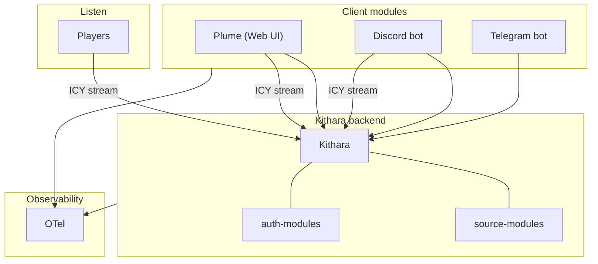

# Component Landscape

<!-- mermaid-source: diagrams/component-landscape.mmd -->

**Kithara** plus its source and auth modules are one backend system. Client modules and players sit outside and talk to it over documented interfaces. Internals (Neck, Stream Server, Auth Orchestrator) stay in the kithara deep dive.

## Components

| Type | Components | MVP |
|------|------------|-----|
| Core monolith | Kithara | Yes |
| Client module | Plume (web), Discord bot, Telegram bot | Yes (Plume); Future (Discord, Telegram) |
| Source module | YouTube, Local input, File source | Yes (YouTube); Future (Direct input, File) |
| Auth adapter | Login+password (MVP), OIDC (v0.2) | Yes (login+password); names undecided |
| Listener | Legacy players | N/A |

**Client modules** are the modular user-facing layer — web, Discord, Telegram, and more. They share Kithara's REST API; only Plume is required for MVP.

No Icecast in MVP — Kithara serves ICY directly.

**Kithara detail:** [Internal structure](https://github.com/Bardie-radio/bardie-kithara/blob/main/docs/architecture/overview/02-internal-structure.md) · [Client modules](https://github.com/Bardie-radio/bardie-kithara/blob/main/docs/architecture/domains/clients.md)

**Related:** [uri-routing](https://github.com/Bardie-radio/bardie-kithara/blob/main/docs/architecture/interfaces/uri-routing.md) · [02-ecosystem-context](02-ecosystem-context.md)

**Read next:** [04-user-journeys.md](04-user-journeys.md)
