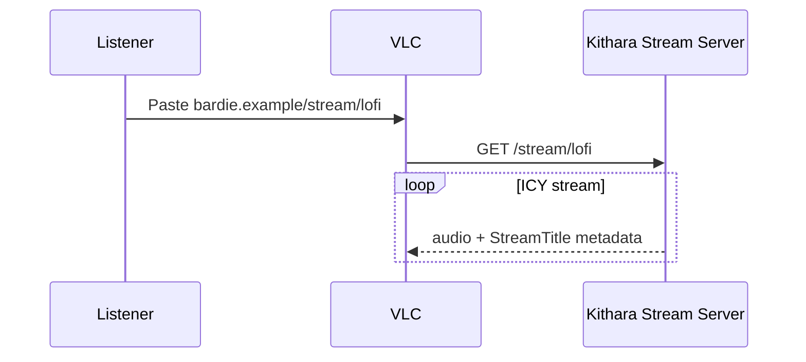
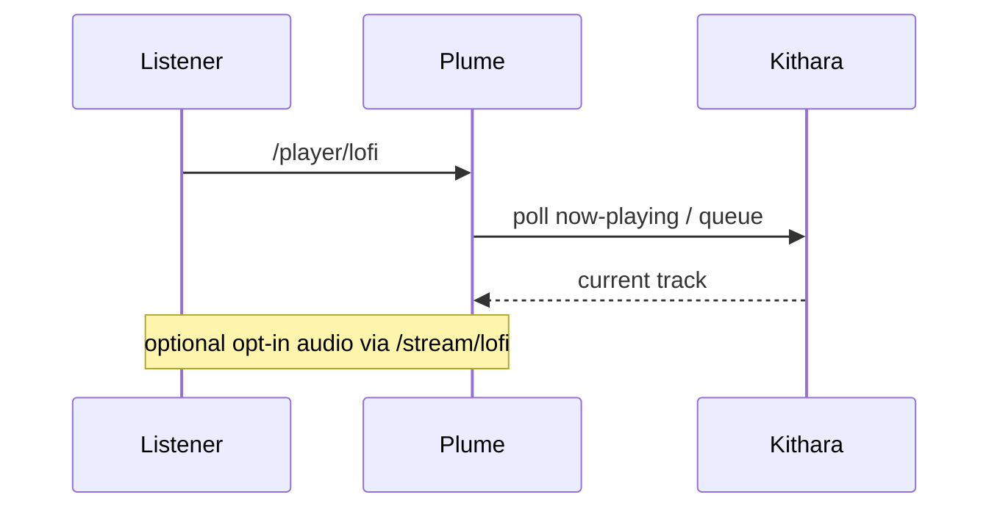
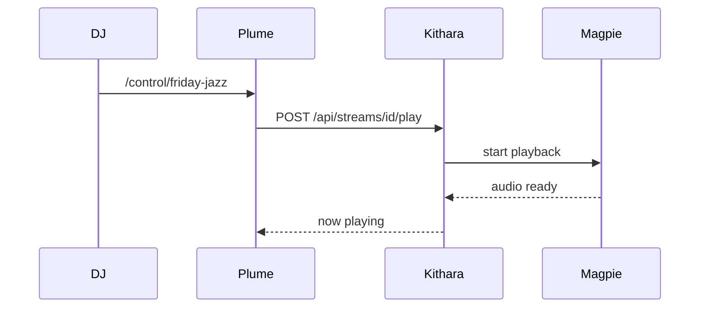
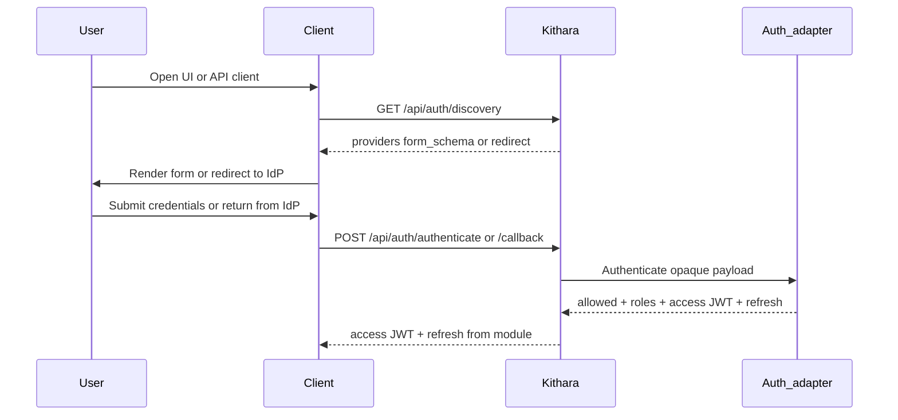

# User Journeys

How listeners, DJs, and login flow across clients, Kithara, and modules. Protocol detail lives in kithara docs. **Plume is optional** — any client module can drive the same Kithara APIs.

## Listen (ICY / legacy player)

<!-- mermaid-source: profile/docs/architecture/diagrams/journey-listen.mmd -->

## Listen (Plume player surface)

<!-- mermaid-source: profile/docs/architecture/diagrams/journey-player.mmd -->

`/player/{slug}` is the listen / player UI. In-browser audio starts **off**; listeners opt in to `/stream/{slug}` when they want sound in the tab. There is no `/listen` path.

## DJ: search and play

<!-- mermaid-source: profile/docs/architecture/diagrams/journey-dj-play.mmd -->

Remote control (queue, search, transport) lives at `/control/{slug}` — not `/player`.

## Login (MVP)

<!-- mermaid-source: profile/docs/architecture/diagrams/journey-login.mmd -->

Identity proof uses auth modules (**Bes**, later **Argus** / **Hecate**) behind Kithara. Modules **issue or forward JWTs** (and own refresh); **Kithara verifies** them via JWKS. Deep dive: [kithara auth](https://github.com/Bardie-radio/kithara/blob/main/docs/architecture/interfaces/auth.md).

Source diagrams: [diagrams/](diagrams/)

**Kithara journeys:** [domains/clients.md](https://github.com/Bardie-radio/kithara/blob/main/docs/architecture/domains/clients.md) · [source sessions](https://github.com/Bardie-radio/kithara/blob/main/docs/architecture/domains/source-instances.md) · [grpc-source-module](https://github.com/Bardie-radio/kithara/blob/main/docs/architecture/interfaces/grpc-source-module.md)

**Related:** [uri-routing](https://github.com/Bardie-radio/kithara/blob/main/docs/architecture/interfaces/uri-routing.md) · [06-client-modules](06-client-modules.md) · [03-component-landscape](03-component-landscape.md)

**Read next:** [05-deployment.md](05-deployment.md)
