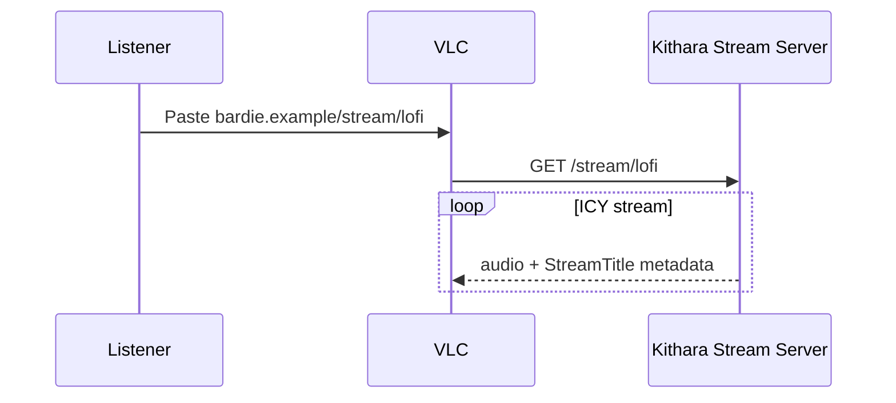
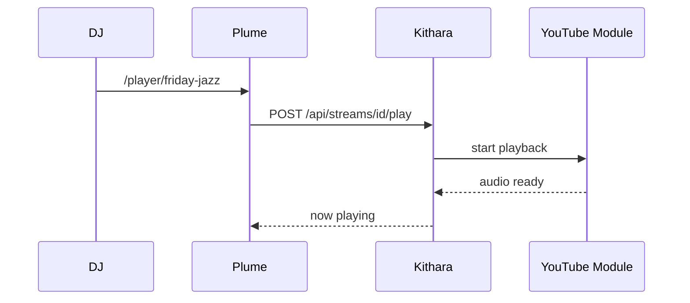
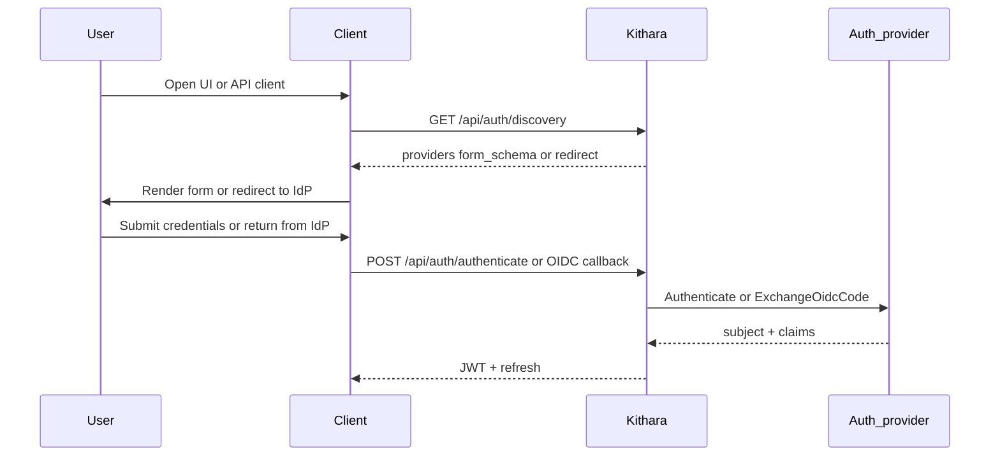

# User Journeys

How listeners, DJs, and login flow across clients, Kithara, and modules. Protocol detail lives in kithara docs. **Plume is optional** — any client module can drive the same Kithara APIs.

## Listen (public stream)

<!-- mermaid-source: profile/docs/architecture/diagrams/journey-listen.mmd -->

## DJ: search and play

<!-- mermaid-source: profile/docs/architecture/diagrams/journey-dj-play.mmd -->

## Login (MVP)

<!-- mermaid-source: profile/docs/architecture/diagrams/journey-login.mmd -->

Identity proof may use the built-in local provider or (v0.2+) an OIDC adapter. **Kithara always issues the JWT.** Deep dive: [kithara auth](https://github.com/Bardie-radio/bardie-kithara/blob/main/docs/architecture/interfaces/auth.md).

Source diagrams: [diagrams/](diagrams/)

**Kithara journeys:** [domains/clients.md](https://github.com/Bardie-radio/bardie-kithara/blob/main/docs/architecture/domains/clients.md) · [source sessions](https://github.com/Bardie-radio/bardie-kithara/blob/main/docs/architecture/domains/source-instances.md) · [grpc-source-module](https://github.com/Bardie-radio/bardie-kithara/blob/main/docs/architecture/interfaces/grpc-source-module.md)

**Related:** [uri-routing](https://github.com/Bardie-radio/bardie-kithara/blob/main/docs/architecture/interfaces/uri-routing.md) · [03-component-landscape](03-component-landscape.md)

**Read next:** [05-deployment.md](05-deployment.md)
