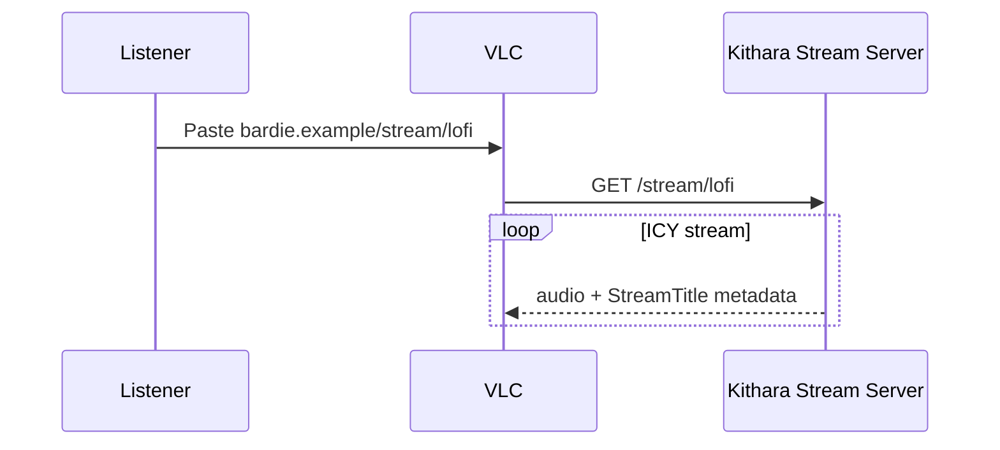
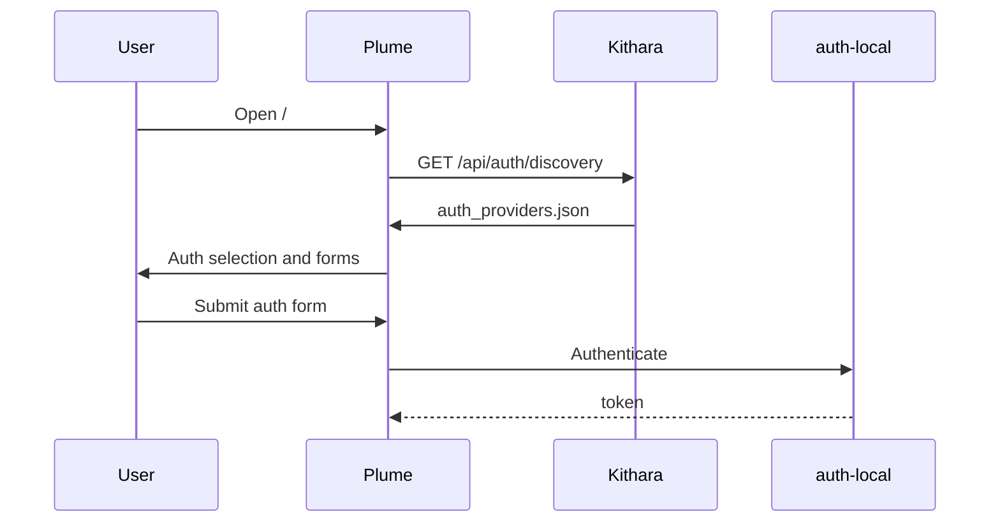

# User Journeys

## Listen (public stream)

<!-- mermaid-source: diagrams/journey-listen.mmd -->

## DJ: search and play

<!-- mermaid-source: diagrams/journey-dj-play.mmd -->

## Login (MVP)

<!-- mermaid-source: diagrams/journey-login.mmd -->

Source diagrams: [diagrams/](diagrams/)

**Kithara journeys:** [domains/clients.md](https://github.com/Bardie-radio/bardie-kithara/blob/main/docs/architecture/domains/clients.md)

**Read next:** [05-deployment.md](05-deployment.md)

