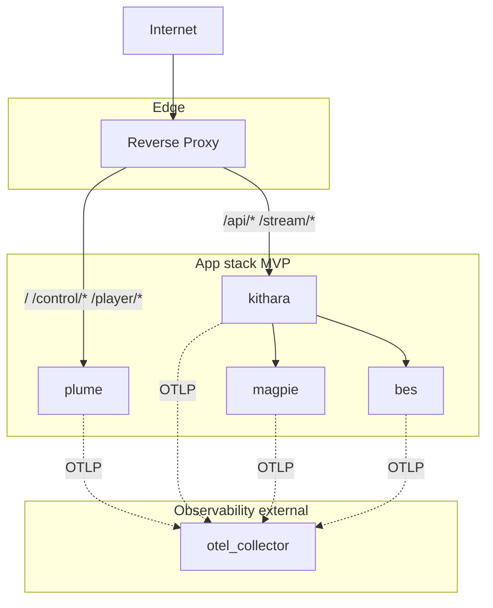

# Deployment

<!-- mermaid-source: profile/docs/architecture/diagrams/deployment-compose.mmd -->

MVP targets a self-hosted app stack behind an **edge reverse proxy**. Listeners and DJs hit one hostname; streams are path-routed, not port-per-stream. Bardie does **not** require a specific proxy product — only TLS termination and the path rules in [URI routing](https://github.com/Bardie-radio/kithara/blob/main/docs/architecture/interfaces/uri-routing.md).

Image and Compose **service names** match the lowercase codename (`kithara`, `plume`, `magpie`, `bes`, …). Short DNS aliases may differ from image names — document both when they differ.

**Password auth is Bes** (`bes`) — a separate auth-adapter container. Kithara owns user storage and **verifies** user JWTs (modules issue or forward them); there is no built-in login provider. **Argus** (`argus`) joins in v0.2 for OIDC.

## Deployment modes

| Mode | When | Edge |
|------|------|------|
| **Bundled edge** | Quick start / demo Compose | Thin reverse proxy included in the Compose file; only `:443` (or `:80`) published |
| **External edge** | Homelab / existing infra | You already run a reverse proxy (or load balancer); Compose publishes app ports only on the internal network / localhost; you point your edge at them |

Both modes use the same path map. Example configuration snippets for popular reverse proxies will ship with the reference Compose bundle — pick what you already know.

## App services

| Service | Role | Published (bundled edge) |
|---------|------|--------------------------|
| edge proxy | TLS + path routing | `:443` |
| `plume` | Web UI / Plume (optional client module) | internal |
| `kithara` | Core API + ICY + auth harness + user DB | internal |
| `magpie` | Magpie — YouTube / ytdl source (MVP) | internal |
| `bes` | Bes — login+password auth (MVP) | internal |
| `argus` | Argus — OIDC (v0.2) | internal when used |
| `otel_collector` | **External** telemetry sink (e.g. Grafana Alloy) | operator-provided |

**MVP: 4 app containers** (Plume, Kithara, Magpie, Bes) + edge. Collector is not a Bardie app — wire OTLP to whatever you already run. Modules authenticate with a **join secret** (`BARDIE_JOIN_SECRETS`).

## Path map

| Path | Target | Notes |
|------|--------|-------|
| `/` | Plume | Home / Struna list (optional if Plume is omitted) |
| `/control/*` | Plume | Remote-control desk — `/control/{slug}` |
| `/player/*` | Plume | Listen / player surface — `/player/{slug}` |
| `/api/*` | Kithara | REST (auth, playback, guest exchange, …) |
| `/stream/{slug}` | Kithara | ICY audio |
| *(no `/listen`)* | — | Use `/player/{slug}` for UI listen; `/stream/{slug}` for ICY |

- OIDC callback stays on Kithara (`/api` …) behind the edge
- gRPC stays **internal-only** (never publish `:5000` on the public edge)
- Without Plume, `/`, `/control/*`, and `/player/*` simply have no UI target at the edge

**Deep dive:** [kithara operations/deployment](https://github.com/Bardie-radio/kithara/blob/main/docs/architecture/operations/deployment.md) · [uri-routing](https://github.com/Bardie-radio/kithara/blob/main/docs/architecture/interfaces/uri-routing.md)

**Related:** [observability naming](https://github.com/Bardie-radio/kithara/blob/main/docs/architecture/operations/observability.md) · [06-client-modules](06-client-modules.md) · [04-user-journeys](04-user-journeys.md)

**Read next:** [README.md](README.md)
