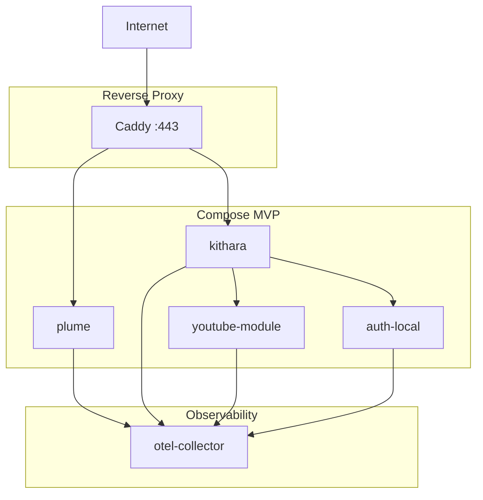

# Deployment

<!-- mermaid-source: diagrams/deployment-compose.mmd -->

MVP targets a single Docker Compose stack behind a reverse proxy. Listeners and DJs hit one hostname; streams are path-routed, not port-per-stream.

## Compose services

| Service | Role | Published |
|---------|------|-----------|
| proxy (Caddy) | TLS + path routing | `:443` |
| plume | Web UI (client module) | internal |
| kithara | Core API + ICY stream server | internal |
| youtube-module | Source module | internal |
| auth-local | Auth adapter (MVP) | internal |
| otel-collector | Telemetry (optional) | internal |

**4 app containers** + proxy + optional collector.

## Routing idea

- Control plane and UI: Plume / Kithara REST behind the proxy
- Audio: `GET /stream/{slug}` → Kithara stream server (ICY)
- No Icecast in MVP — Kithara serves the feed directly

## Dynamic Strunas

GUID internally, slug in the URL. Slug is freed when the Struna stops — no dedicated host or port per stream.

**Deep dive:** [kithara operations/deployment](https://github.com/Bardie-radio/bardie-kithara/blob/main/docs/architecture/operations/deployment.md) · [uri-routing](https://github.com/Bardie-radio/bardie-kithara/blob/main/docs/architecture/interfaces/uri-routing.md)

**Read next:** [README.md](README.md)
