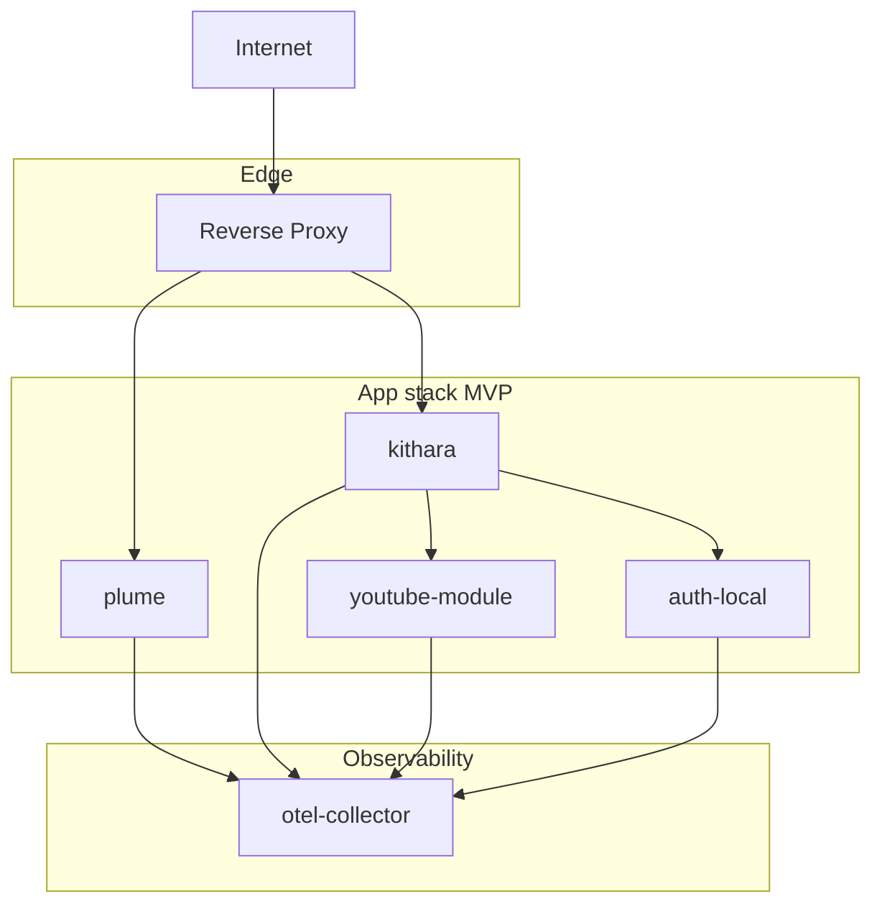

# Deployment

<!-- mermaid-source: diagrams/deployment-compose.mmd -->

MVP targets a self-hosted app stack behind an **edge reverse proxy**. Listeners and DJs hit one hostname; streams are path-routed, not port-per-stream. Bardie does **not** require a specific proxy product — only TLS termination and the path rules in [URI routing](https://github.com/Bardie-radio/bardie-kithara/blob/main/docs/architecture/interfaces/uri-routing.md).

## Deployment modes

| Mode | When | Edge |
|------|------|------|
| **Bundled edge** | Quick start / demo Compose | Thin reverse proxy included in the Compose file; only `:443` (or `:80`) published |
| **External edge** | Homelab / existing infra | You already run a reverse proxy (or load balancer); Compose publishes app ports only on the internal network / localhost; you point your edge at them |

Both modes use the same path map. Example configuration snippets for popular reverse proxies will ship with the reference Compose bundle — pick what you already know.

## App services

| Service | Role | Published (bundled edge) |
|---------|------|--------------------------|
| edge proxy | TLS + path routing | `:443` |
| plume | Web UI (client module) | internal |
| kithara | Core API + ICY stream server | internal |
| youtube-module | Source module | internal |
| auth-local | Auth adapter (MVP) | internal |
| otel-collector | Telemetry (optional) | internal |

**4 app containers** + edge (bundled or external) + optional collector.

## Routing idea

- Control plane and UI: Plume / Kithara REST behind the edge
- Audio: `GET /stream/{slug}` → Kithara stream server (ICY)
- No Icecast in MVP — Kithara serves the feed directly

**Deep dive:** [kithara operations/deployment](https://github.com/Bardie-radio/bardie-kithara/blob/main/docs/architecture/operations/deployment.md) · [uri-routing](https://github.com/Bardie-radio/bardie-kithara/blob/main/docs/architecture/interfaces/uri-routing.md)

**Read next:** [README.md](README.md)
