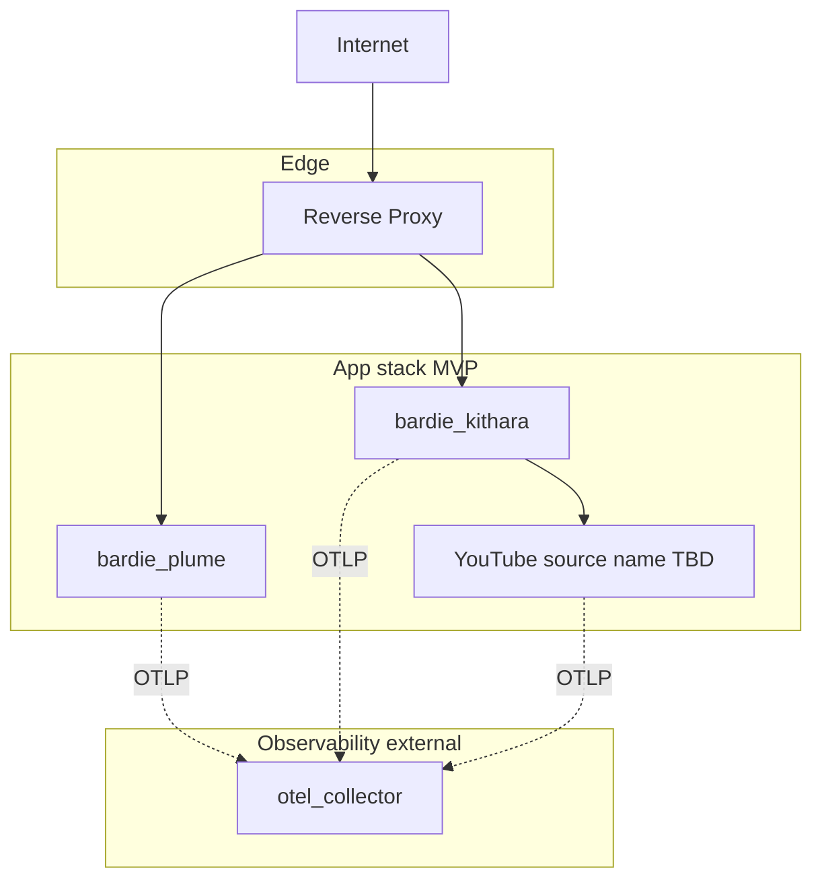

# Deployment

<!-- mermaid-source: profile/docs/architecture/diagrams/deployment-compose.mmd -->

MVP targets a self-hosted app stack behind an **edge reverse proxy**. Listeners and DJs hit one hostname; streams are path-routed, not port-per-stream. Bardie does **not** require a specific proxy product — only TLS termination and the path rules in [URI routing](https://github.com/Bardie-radio/bardie-kithara/blob/main/docs/architecture/interfaces/uri-routing.md).

Image and Compose **service names** use the `bardie_*` prefix once chosen. YouTube (and later OIDC) module names are **undecided** — diagram labels are roles. Short DNS aliases may differ from image names — document both when they differ.

**Local password auth is built into Kithara** for MVP — no separate auth app container until OIDC (v0.2).

## Deployment modes

| Mode | When | Edge |
|------|------|------|
| **Bundled edge** | Quick start / demo Compose | Thin reverse proxy included in the Compose file; only `:443` (or `:80`) published |
| **External edge** | Homelab / existing infra | You already run a reverse proxy (or load balancer); Compose publishes app ports only on the internal network / localhost; you point your edge at them |

Both modes use the same path map. Example configuration snippets for popular reverse proxies will ship with the reference Compose bundle — pick what you already know.

## App services

| Service | Role | Published (bundled edge) |
|---------|------|--------------------------|
| edge proxy | TLS + path routing | `:443` |
| `bardie_plume` | Web UI / Plume (optional client module) | internal |
| `bardie_kithara` | Core API + ICY + local auth | internal |
| YouTube source *(name TBD)* | Source module (MVP) | internal |
| OIDC adapter *(v0.2, name TBD)* | External IdP bridge | internal when used |
| `otel_collector` | **External** telemetry sink (e.g. Grafana Alloy) | operator-provided |

**MVP: 3 app containers** (Plume, Kithara, YouTube) + edge. Collector is not a Bardie app — wire OTLP to whatever you already run. Modules join with a **Compose env join secret**.

## Routing idea

- Control plane and UI: Plume / Kithara REST (and OIDC callback on Kithara) behind the edge
- Audio: `GET /stream/{slug}` → Kithara stream server (ICY)
- No Icecast in MVP — Kithara serves the feed directly
- gRPC stays **internal-only** (never publish `:5000` on the public edge)

**Deep dive:** [kithara operations/deployment](https://github.com/Bardie-radio/bardie-kithara/blob/main/docs/architecture/operations/deployment.md) · [uri-routing](https://github.com/Bardie-radio/bardie-kithara/blob/main/docs/architecture/interfaces/uri-routing.md)

**Related:** [observability naming](https://github.com/Bardie-radio/bardie-kithara/blob/main/docs/architecture/operations/observability.md) · [04-user-journeys](04-user-journeys.md)

**Read next:** [README.md](README.md)
