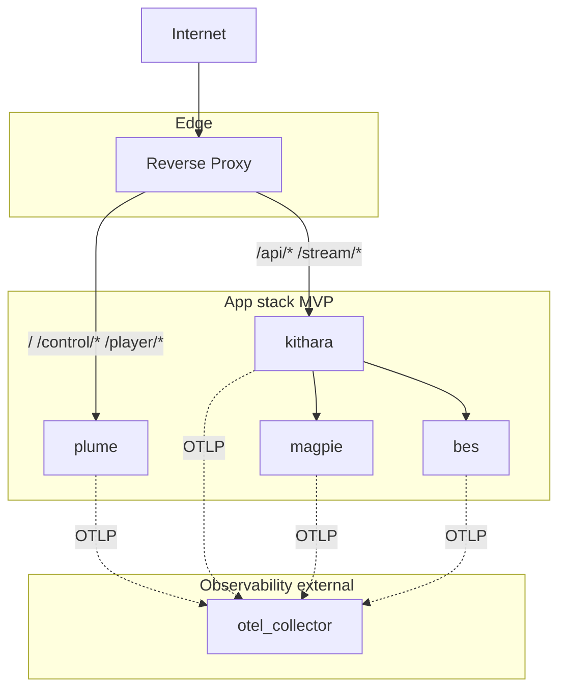

# Deployment

<!-- mermaid-source: profile/docs/architecture/diagrams/deployment-compose.mmd -->

```mermaid
flowchart TB
  subgraph edge [Edge]
    P[Reverse Proxy]
  end
  subgraph apps [App stack MVP]
    Plume[plume]
    Kithara[kithara]
    Magpie[magpie]
    Bes[bes]
  end
  subgraph observe [Observability external]
    OTel[otel_collector]
  end
  Internet --> P
  P -->|"/ /control/* /player/*"| Plume
  P -->|"/api/* /stream/*"| Kithara
  Kithara --> Magpie
  Kithara --> Bes
  Plume -.->|OTLP| OTel
  Kithara -.->|OTLP| OTel
  Magpie -.->|OTLP| OTel
  Bes -.->|OTLP| OTel
```

MVP targets a self-hosted app stack behind an **edge reverse proxy**. Listeners and DJs hit one hostname; streams are path-routed, not port-per-stream. Bardie does **not** require a specific proxy product — only TLS termination and the path rules in [URI routing](https://github.com/Bardie-radio/kithara/blob/main/docs/architecture/interfaces/uri-routing.md).

**Reference Compose + nginx templates:** [`profile/deploy/`](../../deploy/) — pull GHCR images and `docker compose up`.

Image and Compose **service names** match the lowercase codename (`kithara`, `plume`, `magpie`, `bes`, …). Short DNS aliases may differ from image names — document both when they differ.

**Password auth is Bes** (`bes`) — a separate auth-adapter container. Kithara owns user storage and **verifies** user JWTs (modules issue or forward them); there is no built-in login provider. **Argus** (`argus`) joins in v0.2 for OIDC.

## Quick start

```bash
cd profile/deploy          # from a clone of Bardie-radio/.github
cp .env.example .env       # rotate secrets; set PUBLIC_BASE_URL
docker compose up -d       # bundled nginx on :80
```

Open `PUBLIC_BASE_URL` (default `http://localhost`). See [`deploy/README.md`](../../deploy/README.md).

## Deployment modes

| Mode | Compose file | Edge |
|------|--------------|------|
| **Bundled edge** | [`deploy/compose.yml`](../../deploy/compose.yml) | nginx in Compose; only `:80` published ([`edge/nginx.conf`](../../deploy/edge/nginx.conf)) |
| **External edge** | [`deploy/compose.external-edge.yml`](../../deploy/compose.external-edge.yml) | Your proxy; use [`edge/nginx.external.conf.example`](../../deploy/edge/nginx.external.conf.example) |

Both modes use the same path map. TLS: terminate on your external edge (or add certs to nginx later) — the bundled template is HTTP for a fast demo.

## App services

| Service | Role | Published (bundled edge) |
|---------|------|--------------------------|
| edge proxy | Path routing (TLS optional / external) | `:80` |
| `plume` | Web UI / Plume (optional client module) | internal |
| `kithara` | Core API + ICY + auth harness + user DB | internal |
| `magpie` | Magpie — YouTube / ytdl source (MVP) | internal |
| `bes` | Bes — login+password auth (MVP) | internal |
| `argus` | Argus — OIDC (v0.2) | internal when used |
| `otel_collector` | **External** telemetry sink (e.g. Grafana Alloy) | operator-provided |

**MVP: 4 app containers** (Plume, Kithara, Magpie, Bes) + edge + Postgres. Collector is not a Bardie app — wire OTLP to whatever you already run. Modules authenticate with a **join secret** (`BARDIE_JOIN_SECRETS`).

Images: `ghcr.io/bardie-radio/<codename>:<tag>` — see [version-check](../version-check.md) (`IMAGE_TAG` in `.env`).

## Operator configuration

Set these in `deploy/.env` (from [`.env.example`](../../deploy/.env.example)):

| Knob | Purpose |
|------|---------|
| `IMAGE_TAG` | GHCR tag (`latest` or SemVer) |
| `PUBLIC_BASE_URL` | Public origin for Plume stream URLs (must be the edge URL browsers use) |
| `JOIN_SECRET_*` | Per-module join secrets → Kithara `BARDIE_JOIN_SECRETS` + each module’s `BARDIE_JOIN_SECRET` |
| `POSTGRES_USER` / `PASSWORD` / `DB` | Shared by the `db` service and Kithara (Jellyfin-style; no raw EF connection string) |
| `BARDIE_STORAGE_DRIVER` / `BARDIE_STORAGE_PATH` | Required on Kithara — MVP `local` + path under the `/data` volume (default `/data/blobs`) |

Path defaults for mTLS / FIFO / FFmpeg (`/data/mtls`, `/audio`, `/usr/lib`) live in the **images** — Compose only mounts volumes. Shared FIFO volume must be on both Kithara and Magpie. Blob storage is **not** image-only: Compose always sets driver + path.

**Forwarded headers:** unset in the image = **no proxy**. Reference Compose sets `BARDIE_FORWARDED_HEADERS_FORWARD_LIMIT` + `…_CLEAR_KNOWN` on Kithara and Plume. Override hop count or known proxies when your edge topology differs — [configuration](https://github.com/Bardie-radio/kithara/blob/main/docs/architecture/operations/configuration.md).

**OTel:** leave commented in Compose (unset = no export). Uncomment `OTEL_EXPORTER_OTLP_ENDPOINT` / `OTEL_EXPORTER_OTLP_PROTOCOL` (+ `extra_hosts` for a host-run collector) on each app service when you have a collector.

**Volumes** (Compose-managed): Postgres data, per-service `/data` (mTLS + blobs), shared `/audio` FIFOs (Kithara ↔ Magpie), Plume data-protection keys.

Per-container env detail: [Kithara configuration](https://github.com/Bardie-radio/kithara/blob/main/docs/architecture/operations/configuration.md).

## Path map

| Path | Target | Notes |
|------|--------|-------|
| `/` | Plume | Home / Struna list (optional if Plume is omitted) |
| `/control/*` | Plume | Remote-control desk — `/control/{slug}` |
| `/player/*` | Plume | Listen / player surface — `/player/{slug}` |
| `/api/*` | Kithara | REST (auth, playback, guest exchange, …) |
| `/stream/{slug}` | Kithara | ICY audio — long proxy read timeouts |
| *(no `/listen`)* | — | Use `/player/{slug}` for UI listen; `/stream/{slug}` for ICY |

- OIDC callback stays on Kithara (`/api` …) behind the edge
- gRPC stays **internal-only** (never publish `:5000` on the public edge)
- Without Plume, `/`, `/control/*`, and `/player/*` simply have no UI target at the edge

## First boot

1. Capture the registration OTP from Kithara logs (WARNING banner: `KITHARA AUTH-INVITE` / `Registration OTP`).
2. Open Plume `/claim` → username + OTP → complete Bes bind.
3. Create a Struna; listen via `/player/{slug}` or VLC on `/stream/{slug}`.

**Publish gate:** before relying on `IMAGE_TAG=latest`, confirm Plume’s GHCR image includes Vite `wwwroot/dist` — see [Kithara pre-publish-audit](https://github.com/Bardie-radio/kithara/blob/main/docs/architecture/mvp/pre-publish-audit.md).

## Local build-from-source

For developers iterating on source, Local sketches under the multi-root workspace (`local/compose.plume.yml`) still **build** images. Operators should prefer [`profile/deploy/`](../../deploy/) and published GHCR tags.

**Deep dive:** [kithara operations/deployment](https://github.com/Bardie-radio/kithara/blob/main/docs/architecture/operations/deployment.md) · [uri-routing](https://github.com/Bardie-radio/kithara/blob/main/docs/architecture/interfaces/uri-routing.md)

**Related:** [observability naming](https://github.com/Bardie-radio/kithara/blob/main/docs/architecture/operations/observability.md) · [06-client-modules](06-client-modules.md) · [04-user-journeys](04-user-journeys.md)

**Read next:** [README.md](README.md)
