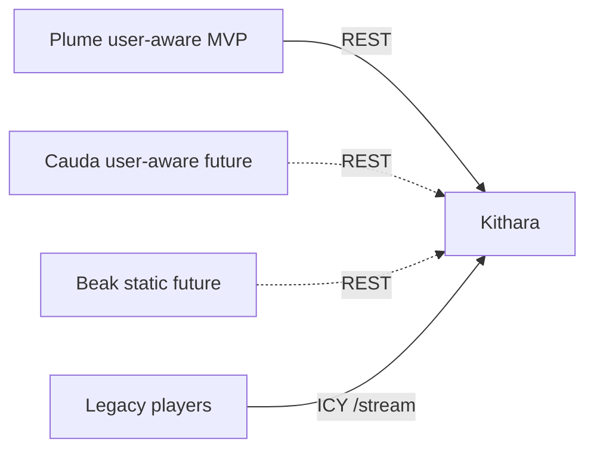

# Client modules

<!-- mermaid-source: profile/docs/architecture/diagrams/client-modules.mmd -->

Bardie’s **user-facing surface is modular**. Each **client module** is a separate deployable that talks to Kithara’s REST API. Legacy players are listen-only — not client modules.

**Core contract** (what Kithara requires): [kithara domains/clients](https://github.com/Bardie-radio/kithara/blob/main/docs/architecture/domains/clients.md).

## Planned clients

| Module | Channel | Auth mode | Status | Capabilities (sketch) | Docs |
|--------|---------|-----------|--------|----------------------|------|
| **Plume** | Web | user-aware | MVP (optional) | `/`, `/player/{slug}`; discovery login; control + optional listen | [architecture](https://github.com/Bardie-radio/plume/tree/main/docs/architecture) |
| **Cauda** | Telegram | user-aware | Planned | Remote Struna control from chats | [planned role](https://github.com/Bardie-radio/cauda/blob/main/docs/architecture/01-planned-role.md) |
| **Beak** | Discord | static | Planned | VC → Struna; **one managed user per guild** | [planned role](https://github.com/Bardie-radio/beak/blob/main/docs/architecture/01-planned-role.md) |

More clients may appear as useful channels show up. Auth modes and static tenancy rules are defined in the [kithara contract](https://github.com/Bardie-radio/kithara/blob/main/docs/architecture/domains/clients.md) — not reinvented per bot.

## Attaching a client to the stack

| Step | Where |
|------|--------|
| Join secret in `BARDIE_JOIN_SECRETS` + container on the Compose network | [05-deployment](05-deployment.md) |
| Register as `user-aware` or `static`; call `/api` with the right credentials | [kithara clients](https://github.com/Bardie-radio/kithara/blob/main/docs/architecture/domains/clients.md) |
| Edge paths for web UI (`/`, `/player/*`) vs API/stream | [uri-routing](https://github.com/Bardie-radio/kithara/blob/main/docs/architecture/interfaces/uri-routing.md) |

gRPC stays internal (sources and auth adapters). Clients do not call those.

**Related:** [03-component-landscape](03-component-landscape.md) · [05-deployment](05-deployment.md) · [02-ecosystem-context](02-ecosystem-context.md)

**Read next:** [05-deployment.md](05-deployment.md)
