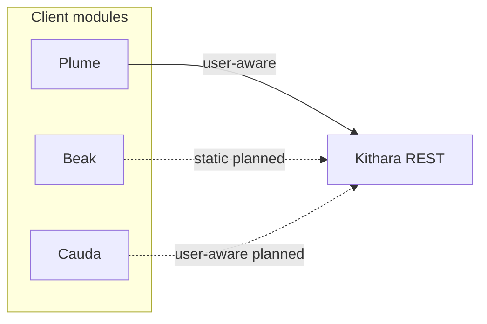

# Client modules

<!-- mermaid-source: profile/docs/architecture/diagrams/client-modules.mmd -->

Catalog of **client modules** — separate deployables that present Bardie on a channel and drive Strunas through Kithara’s REST API. Contracts (auth modes, Register, credentials) live in [kithara domains/clients](https://github.com/Bardie-radio/kithara/blob/main/docs/architecture/domains/clients.md); this page only lists what’s planned and where the repos are.

| Module | Repo | Auth mode | Status | Edge / role |
|--------|------|-----------|--------|-------------|
| **Plume** | [plume](https://github.com/Bardie-radio/plume) | user-aware | MVP (primary web UI) | `/`, `/control/*`, `/player/*` |
| **Beak** | [beak](https://github.com/Bardie-radio/beak) | static | planned | Discord bot |
| **Cauda** | [cauda](https://github.com/Bardie-radio/cauda) | user-aware | planned | Telegram bot |

**Plume paths (locked):** `/control/{slug}` is the remote-control desk; `/player/{slug}` is the listen / player surface. There is no `/listen` route. Legacy players (VLC, VRChat) hit `/stream/{slug}` only — they are not client modules.

Module deep dives:

- [Plume architecture](https://github.com/Bardie-radio/plume/tree/main/docs/architecture)
- [Beak architecture](https://github.com/Bardie-radio/beak/tree/main/docs/architecture) *(planned)*
- [Cauda architecture](https://github.com/Bardie-radio/cauda/tree/main/docs/architecture) *(planned)*

**Related:** [kithara clients](https://github.com/Bardie-radio/kithara/blob/main/docs/architecture/domains/clients.md) · [uri-routing](https://github.com/Bardie-radio/kithara/blob/main/docs/architecture/interfaces/uri-routing.md) · [03-component-landscape](03-component-landscape.md) · [05-deployment](05-deployment.md)

**Read next:** [05-deployment.md](05-deployment.md)
