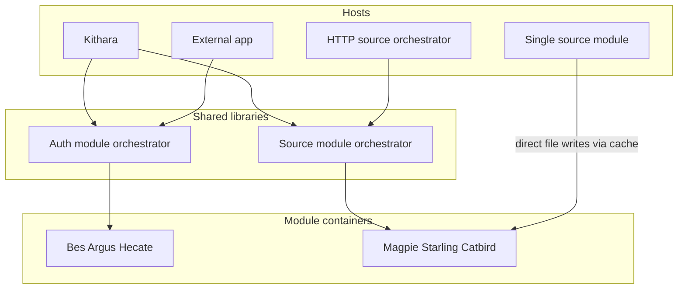

# Modules beyond Bardie

**Status: planned (post-MVP).** Auth and source **module features** are the same in Bardie and outside it. What differs is the **host**: Kithara vs an external app (or a ready-made HTTP source orchestrator). Client UIs (Plume, Beak, Cauda) stay Bardie-facing only.

MVP still ships mesh-only behaviour, but code must stay **library-shaped** so these packages extract cleanly. Seams: modules ([Magpie](https://github.com/Bardie-radio/magpie/blob/main/docs/architecture/03-standalone-and-http.md) · [Bes](https://github.com/Bardie-radio/bes/blob/main/docs/architecture/03-optional-http.md)) and Kithara orchestrators (see below).

## Packaging model

| Piece                               | What it is                                                                                                                                           | Kithara                                                                                                        | Outside                                                             |
| ----------------------------------- | ---------------------------------------------------------------------------------------------------------------------------------------------------- | -------------------------------------------------------------------------------------------------------------- | ------------------------------------------------------------------- |
| **Auth module orchestrator**        | Library: discovery merge, route `Authenticate` / `Refresh`, JWKS verify helpers, `SeedAdmin` when asked; **host ports** for user/binding persistence | Uses the library; implements ports with Kithara user DB (+ Bardie-only extras: guests, join secrets, REST BFF) | Same library in their project; they implement the persistence ports |
| **Source module orchestrator**      | Library: module directory, fan-out / targeted search, route download / track jobs, **storage API** modules put/get through                           | Uses the library; Neck/FIFO/ICY stay Kithara-only around it                                                    | Ready-made **HTTP orchestrator** binary built on the same library   |
| **Auth / source module containers** | Command core + gRPC (+ optional HTTP facades)                                                                                                        | Behind Kithara                                                                                                 | Behind orch library / HTTP orch, or solo (sources)                  |

Same module features either way. Outside users are not reinventing routing — they reuse the orchestrator libraries Kithara already runs.

## Pluggable authentication (planned)

Bes, Argus, Hecate stay pluggable **adapter containers**. The **auth module orchestrator library** is what you embed once; add login methods by installing more adapters.

Deep dive: [Bes](https://github.com/Bardie-radio/bes/blob/main/docs/architecture/03-optional-http.md) · [Argus](https://github.com/Bardie-radio/argus/blob/main/docs/architecture/01-planned-role.md) · [Hecate](https://github.com/Bardie-radio/hecate/blob/main/docs/architecture/01-planned-role.md).

## Standalone source tools (planned)

### Multi-module — HTTP source orchestrator

Ship a small HTTP service on the **source module orchestrator** library: fan-out search, query a specific module, download. Same routing Kithara uses; no Strunas / FIFOs / ICY.

### Single module — no orchestrator

If the use case is one Magpie (or Starling/Catbird) alone, skip the orchestrator. The module switches to **direct file writes** through its existing **cache** path: same download/cache pipeline, but the storage backend is local finished files instead of the orchestrator (or Kithara) storage API. Sink is a file the module creates, not a session FIFO.

Pattern: [Magpie](https://github.com/Bardie-radio/magpie/blob/main/docs/architecture/03-standalone-and-http.md) · [Starling](https://github.com/Bardie-radio/starling/blob/main/docs/architecture/01-planned-role.md) · [Catbird](https://github.com/Bardie-radio/catbird/blob/main/docs/architecture/01-planned-role.md).

## MVP obligation (don’t forget)

| Layer                 | Leave loose now                                                                                                     |
| --------------------- | ------------------------------------------------------------------------------------------------------------------- |
| Kithara Auth / Search | Implement as **libraries with host ports**, even if packages still live inside the kithara repo at first            |
| Modules               | **Commands** + gRPC/HTTP **façades**; **storage/sink** behind an interface (orch/Kithara API vs direct cache files) |

Exact package names and repos are TBD; the dependency direction above is the freeze.

**Related:** [03-component-landscape](03-component-landscape.md) · [06-client-modules](06-client-modules.md) · [org hub](README.md)

**Read next:** [README.md](README.md)