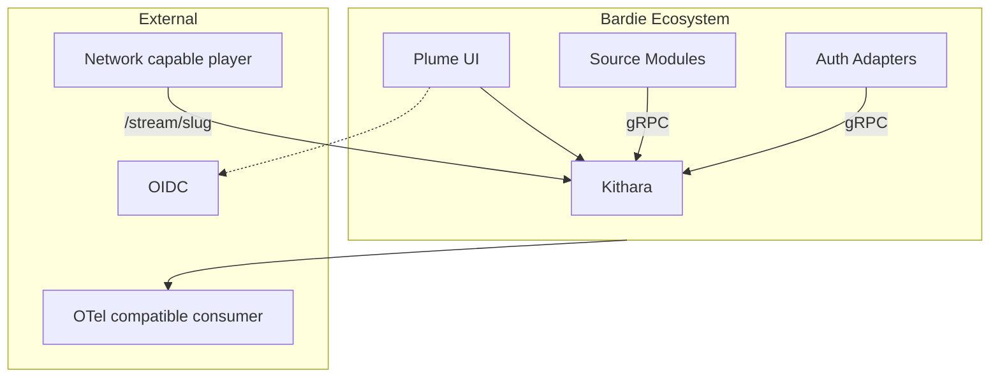

# Bardie Architecture (Org Overview)

<!-- mermaid-source: diagrams/overview.mmd -->

5–10 minute orientation for the Bardie ecosystem. Every page opens with a diagram.

**Deep dive:** [bardie-kithara/docs/architecture](https://github.com/Bardie-radio/bardie-kithara/tree/main/docs/architecture)

## Pages

| # | Page | Time |
|---|------|------|
| 1 | [Vision and goals](01-vision-and-goals.md) | 2 min |
| 2 | [Ecosystem context](02-ecosystem-context.md) | 2 min |
| 3 | [Component landscape](03-component-landscape.md) | 3 min |
| 4 | [User journeys](04-user-journeys.md) | 3 min |
| 5 | [Deployment](05-deployment.md) | 3 min — whole-stack process; per-container detail in each repo |

## Repositories

| Repo | Role |
|------|------|
| [bardie-kithara](https://github.com/Bardie-radio/bardie-kithara) | Core backend |
| [bardie-plume](https://github.com/Bardie-radio/bardie-plume) | Web UI |
| — | Login+password auth adapter (MVP) — module and repo name undecided |

**Read next:** [01-vision-and-goals.md](01-vision-and-goals.md)
