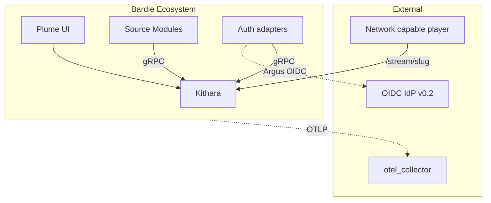

# Bardie Architecture (Org Overview)

<!-- mermaid-source: profile/docs/architecture/diagrams/overview.mmd -->

5–10 minute orientation for the Bardie ecosystem. Every page opens with a diagram.

**Deep dive:** [kithara/docs/architecture](https://github.com/Bardie-radio/kithara/tree/main/docs/architecture)

## Pages

| # | Page | Time |
|---|------|------|
| 1 | [Vision and goals](01-vision-and-goals.md) | 2 min |
| 2 | [Ecosystem context](02-ecosystem-context.md) | 2 min |
| 3 | [Component landscape](03-component-landscape.md) | 3 min |
| 4 | [User journeys](04-user-journeys.md) | 3 min |
| 5 | [Deployment](05-deployment.md) | 3 min — whole-stack process; per-container detail in each repo |
| 6 | [Client modules](06-client-modules.md) | 2 min — planned clients + how they attach |

## Repositories

| Repo | Role | Docs |
|------|------|------|
| [kithara](https://github.com/Bardie-radio/kithara) | Core backend | [architecture](https://github.com/Bardie-radio/kithara/tree/main/docs/architecture) |
| [plume](https://github.com/Bardie-radio/plume) | Web UI (Plume, MVP) | [architecture](https://github.com/Bardie-radio/plume/tree/main/docs/architecture) |
| [bes](https://github.com/Bardie-radio/bes) | Login+password (Bes, MVP) | [architecture](https://github.com/Bardie-radio/bes/tree/main/docs/architecture) |
| [magpie](https://github.com/Bardie-radio/magpie) | YouTube / ytdl (Magpie, MVP) | [architecture](https://github.com/Bardie-radio/magpie/tree/main/docs/architecture) |
| [beak](https://github.com/Bardie-radio/beak) | Discord (Beak) — planned | [planned role](https://github.com/Bardie-radio/beak/blob/main/docs/architecture/01-planned-role.md) |
| [cauda](https://github.com/Bardie-radio/cauda) | Telegram (Cauda) — planned | [planned role](https://github.com/Bardie-radio/cauda/blob/main/docs/architecture/01-planned-role.md) |
| [starling](https://github.com/Bardie-radio/starling) | External stream (Starling) — planned | [planned role](https://github.com/Bardie-radio/starling/blob/main/docs/architecture/01-planned-role.md) |
| [catbird](https://github.com/Bardie-radio/catbird) | Files (Catbird) — planned | [planned role](https://github.com/Bardie-radio/catbird/blob/main/docs/architecture/01-planned-role.md) |
| [argus](https://github.com/Bardie-radio/argus) | OIDC (Argus, v0.2) — planned | [planned role](https://github.com/Bardie-radio/argus/blob/main/docs/architecture/01-planned-role.md) |
| [hecate](https://github.com/Bardie-radio/hecate) | Passkeys (Hecate) — planned | [planned role](https://github.com/Bardie-radio/hecate/blob/main/docs/architecture/01-planned-role.md) |

**Read next:** [01-vision-and-goals.md](01-vision-and-goals.md)
