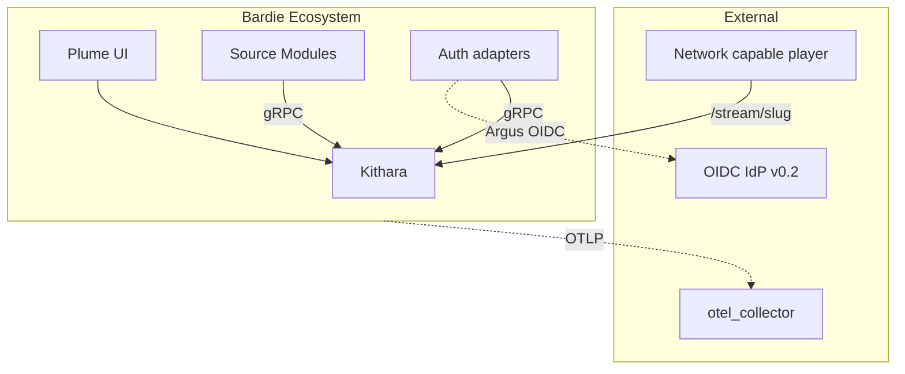

# Bardie Architecture (Org Overview)

<!-- mermaid-source: profile/docs/architecture/diagrams/overview.mmd -->

5–10 minute orientation for the Bardie ecosystem. Every page opens with a diagram.

**Deep dive:** [bardie-kithara/docs/architecture](https://github.com/Bardie-radio/bardie-kithara/tree/main/docs/architecture)

## Pages

| # | Page | Time |
|---|------|------|
| 1 | [Vision and goals](01-vision-and-goals.md) | 2 min |
| 2 | [Ecosystem context](02-ecosystem-context.md) | 2 min |
| 3 | [Component landscape](03-component-landscape.md) | 3 min |
| 4 | [User journeys](04-user-journeys.md) | 3 min |
| 5 | [Deployment](05-deployment.md) | 3 min — whole-stack process; per-container detail in each repo |

## Repositories

| Repo | Role |
|------|------|
| [bardie-kithara](https://github.com/Bardie-radio/bardie-kithara) | Core backend |
| [bardie-plume](https://github.com/Bardie-radio/bardie-plume) | Web UI (Plume) |
| [bardie-bes](https://github.com/Bardie-radio/bardie-bes) | Login+password auth (Bes, MVP) — WIP |
| [bardie-magpie](https://github.com/Bardie-radio/bardie-magpie) | YouTube / ytdl source (Magpie, MVP) — WIP |
| [bardie-beak](https://github.com/Bardie-radio/bardie-beak) | Discord bot (Beak) — planned |
| [bardie-cauda](https://github.com/Bardie-radio/bardie-cauda) | Telegram bot (Cauda) — planned |
| [bardie-starling](https://github.com/Bardie-radio/bardie-starling) | External stream source (Starling) — planned |
| [bardie-catbird](https://github.com/Bardie-radio/bardie-catbird) | File source (Catbird) — planned |
| [bardie-argus](https://github.com/Bardie-radio/bardie-argus) | OIDC auth (Argus, v0.2) — planned |
| [bardie-hecate](https://github.com/Bardie-radio/bardie-hecate) | Passkeys auth (Hecate) — planned |

**Read next:** [01-vision-and-goals.md](01-vision-and-goals.md)
